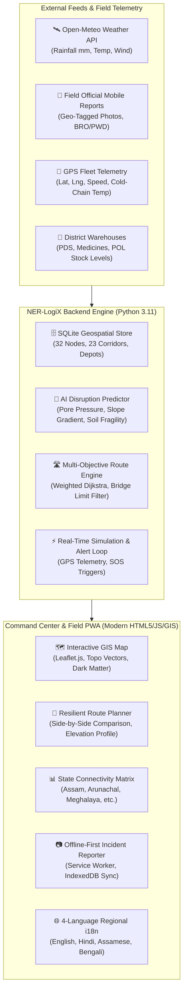

# NER-LogiX: North Eastern Regional Logistics & Accessibility Intelligence Platform
**AI-Powered Smart Logistics, GIS Accessibility Monitoring, and Disruption Resilience Engine for North Eastern India**

[](#)
[](#)
[](#)
[](#)

---

## 📌 Executive Summary

The **North Eastern Region (NER)** of India faces unique geographical, meteorological, and infrastructural challenges:
- High Himalayan and Purvanchal rugged mountain terrains prone to devastating monsoon-induced landslides, mudflows, and rock avalanches.
- World-record rainfall zones (Cherrapunji/Mawsynram in Meghalaya, Teesta basin in Sikkim, Barak valley in southern Assam).
- Strategic bottleneck corridors (Siliguri corridor "Chicken's Neck", NH-29 Paglapahar gorge connecting Nagaland/Manipur, NH-6 Sonapur tunnel corridor).
- Isolated district logistics hubs vulnerable to stock depletion of critical life-saving medicines, PDS grains, and petroleum reserves.

**NER-LogiX** is an end-to-end, AI-powered Logistics and Accessibility Intelligence Platform designed specifically to overcome these challenges. The platform fuses **Geographic Information Systems (GIS)**, **Machine Learning Disruption Risk Models**, **Graph-based Resilient Routing**, **Real-Time GPS Fleet Telemetry**, **Crowdsourced Geo-Tagged Field Incident Reporting**, and **Offline-First Synchronization** to ensure continuous movement of essential goods across all 8 North Eastern States (Ashta Lakshmi).

---

## 🚀 Key Capabilities Mapped to Problem Requirements

| Requirement | System Capability & Implementation |
|---|---|
| **a. Real-time Road, Bridge & Transport Monitoring** | Centralized GIS interactive map tracking 32 strategic district nodes and 23 key road corridors across all 8 states with real-time status: `OPEN`, `CAUTION`, `BLOCKED`, slope angle, rainfall, and bridge weight limits (Metric Tonnes). |
| **b. AI Predictive Disruption Engine** | Multi-factor geotechnical and climatic hazard prediction model evaluating 24h precipitation, slope steepness ($>35^\circ$), soil fragility (weathered shale/clay), river basin flood gauges, and field incident density to calculate real-time disruption probabilities ($0-100\%$) and estimated delay hours. |
| **c. AI Alternate Route Suggestions & Travel Delays** | Graph-based multi-factor Dijkstra/A* routing algorithm. Intelligently identifies blocked segments (e.g. Paglapahar landslide on NH-29) and computes dynamic resilient alternate bypasses (e.g. Dimapur-Peren-Imphal bypass or Haflong Hill corridor) with side-by-side comparison of distance, travel time, delay, and safety scores. |
| **d. GPS Fleet Tracking for Essential Commodities** | Real-time moving telemetry simulation tracking 12+ multi-category vehicles: 💊 **Life-Saving Medicines & Cold-Chain Vaccines** (live temperature monitoring), 🌾 **Food & PDS Grains**, 🏗️ **Infrastructure Materials**, 🚜 **Perishable Agri Produce**, and ⛽ **Fuel/POL Tankers**. |
| **e. Automated Alerts & High-Risk Corridors** | Autonomous real-time alert ticker and push notifications for road blockages, critical medicine stock buffer drops ($<3.5$ days), severe cloudburst advisories, and driver SOS triggers. |
| **f. Field Official Geo-Tagged Incident Reporting** | Mobile-responsive field reporting interface allowing PWD, BRO, SDRF, and local officers to capture GPS coordinates, attach live site photos (base64 compressed), set severity, and report disruptions with instant corridor status escalation. |
| **g. Centralized Dashboards** | KPI matrix displaying overall regional connectivity ($87\%$), state-by-state connectivity scores, critical buffer warehouse depletion tracking, and SDRF/NDRF designated emergency corridors. |
| **h. Multilingual Support & Offline Data Sync** | Instant one-click language switching between **English**, **Hindi (हिंदी)**, **Assamese (অসমীয়া)**, and **Bengali (বাংলা)**. Built with Service Worker PWA caching and IndexedDB offline queueing to allow field reports to be drafted in zero-connectivity mountain passes and automatically synced upon reconnection. |

---

## 🏛️ System Architecture



---

## 📁 Repository Structure

```
├── server.py               # Pure Python REST API & Static Web Server (Port 8080)
├── start.bat               # Windows batch launcher (One-click launch)
├── run.ps1                 # PowerShell startup script
├── data/
│   ├── db.py               # SQLite schema, indices & seed data for all 8 NER states
│   └── ner_logistics.db    # SQLite database file
├── ml_engine/
│   └── predictor.py        # AI/ML Disruption Risk & Landslide Vulnerability Model
├── routing/
│   └── route_engine.py     # Multi-factor Graph Routing & Resilient Alternate Finder
└── static/
    ├── index.html          # Central Logistics & Command Portal
    ├── style.css           # Glassmorphism, GIS styling & responsive design
    ├── app.js              # State management, Map rendering, GPS telemetry & i18n
    ├── sw.js               # Service Worker for offline PWA operation
    ├── manifest.json       # PWA manifest
    └── icons/              # App launcher icons
```

---

## ⚡ Quick Start Guide

### Option 1: One-Click Launch (Windows Batch)
Double-click `start.bat` in the root folder. It will start the server and automatically open the application in your default browser at `http://localhost:8080`.

### Option 2: PowerShell
Run the included PowerShell script:
```powershell
.\run.ps1
```

### Option 3: Direct Python Command
Using the included portable Python environment:
```powershell
.\python_env\python.exe server.py 8080
```
Or with your system Python:
```bash
python server.py 8080
```
Open **[http://localhost:8080](http://localhost:8080)** in any modern web browser (Edge, Chrome, Firefox, Brave).

---

## 📡 REST API Reference

| Endpoint | Method | Description |
|---|---|---|
| `/api/health` | `GET` | Health status, platform version, and server timestamp. |
| `/api/dashboard-stats` | `GET` | High-level metrics: connectivity %, blocked corridors, active fleet, and state matrix. |
| `/api/corridors` | `GET` | All 23 monitored road corridors with slope, rainfall, status, and disruption risk scores. |
| `/api/vehicles` | `GET` | Real-time GPS coordinates, speed, route progress, and cold-chain temperatures. |
| `/api/vehicles/update-gps` | `POST` | Advances vehicle positions along their routes to simulate live telemetry. |
| `/api/vehicles/sos` | `POST` | Toggles emergency SOS beacon for any vehicle carrying critical supplies. |
| `/api/route-plan` | `POST` | Calculates AI Resilient Route, Direct Route, and Emergency Bypass corridors. |
| `/api/incidents` | `GET` | Retrieves all field reports with photos, verification status, and coordinates. |
| `/api/incidents` | `POST` | Submits a new geo-tagged incident report with photo; updates corridor risk immediately. |
| `/api/depots` | `GET` | Supply buffer warehouse inventory levels and days of stock remaining. |
| `/api/alerts` | `GET` | Active emergency alerts feed for blockages and stock depletion. |
| `/api/weather` | `GET` | Live meteorological proxy via Open-Meteo API for any coordinates in NER. |
| `/api/simulate-weather-event`| `POST` | Interactive demo: triggers 145mm cloudburst to demonstrate AI recalibration. |

---

## 🌟 Interactive Demonstration Highlights

1. **AI Resilient Routing Demonstration**:
   - In the **AI Route Planner** tab, select Origin: **Guwahati Logistics Gateway** and Destination: **Imphal State Logistics Hub**.
   - Notice that the direct route via `NH-29-S` through Paglapahar is **BLOCKED** due to a verified rockfall.
   - The AI engine automatically calculates the **AI-Recommended Resilient Route** via the **Peren bypass (`NH-2-ALT`)**, which is 100% open with zero delay!
   - In contrast, the Direct Route flags a **+10.0 hour delay** and highlights the danger zone on the map.

2. **Monsoon Cloudburst Simulation**:
   - Click the **"Simulate Cloudburst"** button in the header.
   - The system simulates an extreme 145mm rainfall event over Nagaland and Assam hill corridors.
   - Watch the AI disruption model dynamically recalculate risk scores, escalate road statuses to `CAUTION` and `BLOCKED`, and broadcast critical alerts across the ticker.

3. **Field Incident Reporting with Photo & Offline Sync**:
   - Click **"Field Incident Report"**.
   - The modal allows input of title, classification (Landslide, Mudflow, Bridge Damage), coordinates (with auto-GPS), photo upload, and clearance estimation.
   - Disconnect your internet (or set DevTools to Offline) and submit a report: the platform automatically queues the report locally in `localStorage`/IndexedDB and displays an offline toast.
   - Re-enable the connection: the Service Worker instantly detects network restoration and syncs the queued report to the central database!

4. **Multilingual Regional Support**:
   - Use the language dropdown in the top navigation bar to switch seamlessly between **English**, **हिंदी**, **অসমীয়া**, and **বাংলা**. Every label, metric, and header updates instantly without reloading the page.
